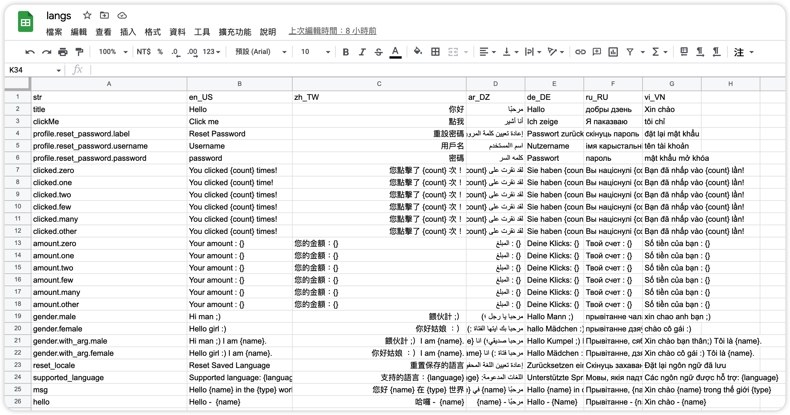
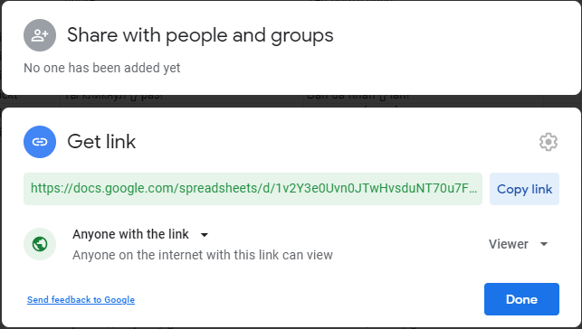
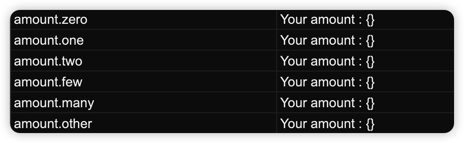
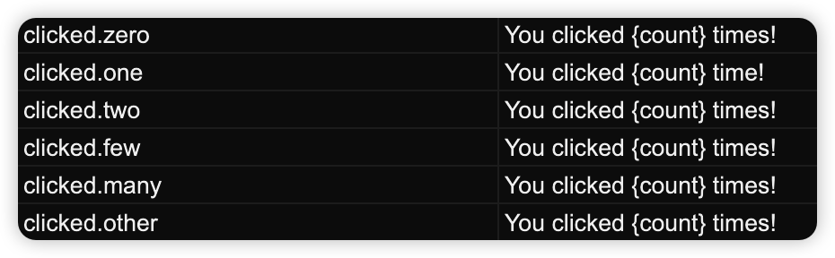

# easy_localization_generator

[](https://pub.dev/packages/easy_localization_generator)


## Easy Localization Generator

Download CSV file and generates the localization keys from an online Google Sheet to working with [easy_localization](https://pub.dev/packages/easy_localization) and [easy_localization_loader](https://pub.dev/packages/easy_localization_loader)

This tool inspired by [flutter_sheet_localization_generator](https://pub.dev/packages/flutter_sheet_localization_generator)

### 🔩 Installation

Add to your `pubspec.yaml`:

```yaml
dependencies:
  easy_localization: <last_version>
  easy_localization_loader: <last_version>

dev_dependencies:
  build_runner: <last_version>
  easy_localization_generator: <last_version>
```

### 🔌 Usage

#### 1. Create a CSV Google Sheet

Create a sheet with your translations. Make sure that all dynamic-arg strings have names of arg. It will generate readable functions of translation to use.
 (following the bellow format, [an example sheet is available here](https://docs.google.com/spreadsheets/d/1hK27E8bIxU8rrOduGJWLTD2QRR1ALs6lyW7dPNZ3N74/edit?usp=sharing)) :



Make sure that your sheet is shared.



Extract from the link the `DOCID` value : `https://docs.google.com/spreadsheets/d/<DOCID>/edit?usp=sharing`

#### 2. Declare a localization delegate

Declare the following `_Strings` class with the `SheetLocalization` annotation pointing to your sheet in a `lib/localization/strings.dart` file
``` dart
import 'dart:ui';

import 'package:easy_localization_generator/easy_localization_generator.dart';

part 'strings.g.dart';

@SheetLocalization(
  docId: 'DOCID',
  version: 1, // the `1` is the generated version.
  //You must increment it each time you want to regenerate a new version of the labels.
  outDir: 'assets/langs', //default directory save downloaded CSV file
  outName: 'langs.csv', //default CSV file name
  preservedKeywords: [
    'few',
    'many',
    'one',
    'other',
    'two',
    'zero',
    'male',
    'female',
  ],
)
class _Strings {}
```

#### 3. Generate your localizations

Run the following command to generate a `lib/localization/strings.g.dart` file :

``` bash
flutter pub run build_runner build --delete-conflicting-outputs
```

Sample of [strings.g.dart](https://github.com/rinlv/easy_localization_generator/blob/main/example/lib/localization/strings.g.dart)

#### 4. Configure your app
Config step by step following this tutorial from [README.md of easy_localization ](https://github.com/aissat/easy_localization/blob/develop/README.md)

#### 5. Development
##### Simple text
``` dart
Text(Strings.title)
```
##### Text with args
``` dart
Text(
  Strings.msg(
    name: 'Jack',
    type: 'Hot',
  ),
),
```
##### Text with plural
- no named arg version


``` dart
Text(Strings.amount(counter))
```
- named arg version (recommend)


``` dart
Text(
  Strings.clicked(
    counter,
    count: counter,
  ),
),
```

### ⚡ Regeneration

Because of the caching system of the build_runner, it can't detect if there is a change on the distant sheet and it can't know if a new generation is needed.

The `version` parameter of the `@SheetLocalization` annotation solves this issue.

Each time you want to trigger a new generation, simply increment that version number and call the build runner again.

### ❓️ Why ?

I find the [easy_localization](https://pub.dev/packages/easy_localization) has already [Code generation](https://github.com/aissat/easy_localization/blob/develop/README.md#-code-generation), but it doesn't support working with Google Sheet and generate keys from CSV file. So, I make this simple generator tool.

## OPTION 2: Easy Localization Generator with [flutter_gen](https://github.com/FlutterGen/flutter_gen)

I forked and then added some code, which make Easy Localization Generator can working with it. Please checkout [here](https://github.com/rinlv/flutter_gen/tree/easy_localization).
